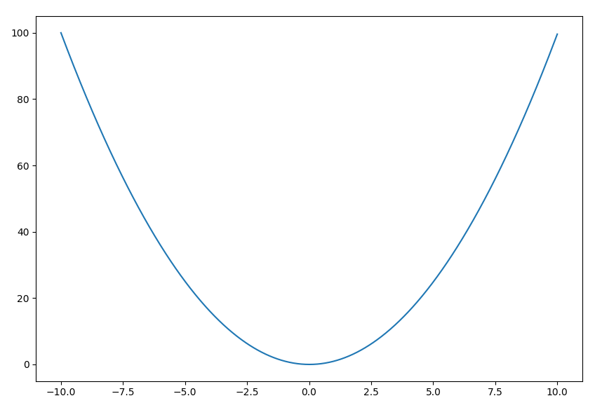
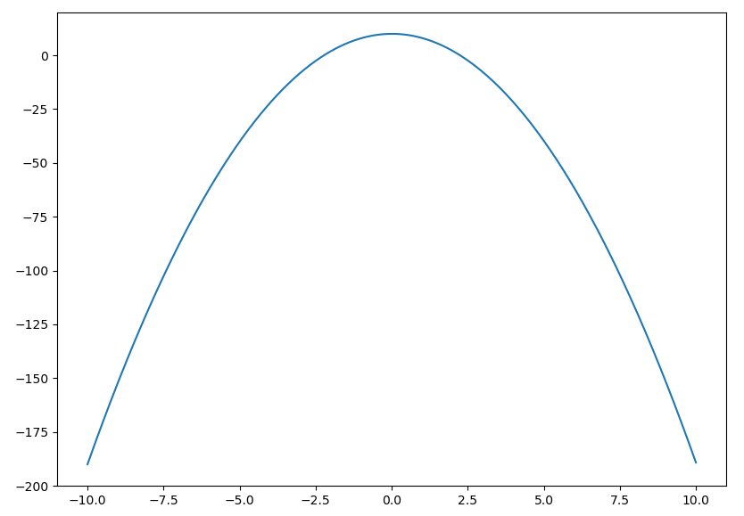

+++ 
draft = false
date = 2023-01-06T16:02:35+00:00
title = "Creating a Conda package for a project with Fortran and Python code"
description = "How to build and distribute a Conda package from a project with Fortran and Python code"
tags = ["fortran", "python", "conda"]
images = ["posts/conda-package-fortran-python/conda-recipe.png"]
+++

Creating a Conda package is a great way to package and distribute your project’s software and its dependencies in a platform- and language-agnostic way. As Conda packages distribute compiled binaries, rather than your source code, they are not limited to specific programming languages (e.g. unlike Python packages distributed via PyPI). This makes them particularly suited to complex projects that might use a selection of different languages.

One common paradigm in scientific computing is the combined use of Fortran and Python. Fortran is often used for underlying models and algorithms that are computationally intensive, whilst the plethora of data processing packages available in Python are leveraged to provide advanced data parsing and visualisation capabilities. This is a paradigm I often use in my own work.

Despite this, there is not a huge amount of info out there on packaging Fortran with Conda, let alone packaging it alongside Python code. So I thought a simple tutorial along these lines might be a useful resource.


Some knowledge of Python packaging would be useful (I will use `setuptools` here, but the concepts introduced will be generally applicable to whichever packaging tool you wish to use). If you've never packaged a Python project before, it might be worth checking out [this tutorial](https://packaging.python.org/en/latest/tutorials/packaging-projects/) and/or [this documentation](https://setuptools.pypa.io/en/latest/userguide/index.html). Basic knowledge of Conda, Git and Fortran development would also be useful.



I have written this tutorial to be cross-platform, but I have only tested it on Linux (Ubuntu 22.04) and Windows 10. Slight tweaks might be needed to make it work on MacOS.


## The project

The repo for this tutorial is on GitHub, so feel free to head over there to see the complete example:



Let's take a really simple example: We have some Fortran code that calculates a quadratic curve, then we have some Python code that uses this to plot a graph of the quadratic curve, based on some input parameters from the user.

Our project code will be structured like this:

```
src/
	pyf/
		quadratic.f90
		plot.py
		cli.py
README.md
LICENSE
```

The `quadratic.f90` file is the Fortran code that calculates the quadratic curve. `plot.py` calls this Fortran code and plots the curve, and `cli.py` provides a command line interface to the Python code (and thus, indirectly, the Fortran library).

If you're wondering about the seemingly overcomplicated `src/py-f-conda-package` structure, this is a standard way of structuring a Python package, and is needed when we use `pip` install the package later.

If you plan to distribute your package or upload to somewhere like GitHub, then you will want to provide at least README and LICENSE files too.

### The Fortran code

The goal of the Fortran code is to calculate a curve based on the standard quadratic equation:

$$
y=ax^2 + bx + c
$$

Therefore, we will create a Fortran subroutine that reads in $a$, $b$ and $c$ as parameters, alongside the $x$-range over which to evaluate the function, given by `x_min`, `x_max` and `N` (number of steps):

```fortran
subroutine calc_quadratic(a, b, c, x_min, x_max, N, y) bind(c, name='calc_quadratic')
    use iso_c_binding, only: c_double, c_int
    implicit none

    ! Input parameters
    real(c_double), intent(in), value :: a, b, c, x_min, x_max
    ! Number of steps over which to calculate y
    integer(c_int), intent(in), value :: N
    ! Array representing y
    real(c_double), intent(out) :: y(N)
    integer :: i            ! Iterator
    real(c_double) :: x     ! Temporary x for each iteration

    ! Iterate over our x range and calculate y at each step
    do i = 1, N
        x = x_min + (i - 1) * (x_max - x_min) / real(N)
        y(i) = a * x ** 2 + b * x + c
    end do
end subroutine
```

To call our function from Python, we are going to use `iso_c_binding` on the Fortran side, and the `ctypes` package on the Python side, which combined allow us to create an interface between Fortran and Python, with C as the intermediary. In the above, we use `bind(c, name='calc_quadratic')` after the subroutine declaration to bind our Fortran function to a C function named `calc_quadratic`, and we use the `c_double` and `c_int` type declarations to make our Fortran variables compatible with C types. Note that the return type of a C-interoperable Fortran function cannot be an array, so we use a subroutine instead and pass back the calculated quadratic curve via the `y` parameter. The `value` keywords for our input parameters are important.

If you want to learn more about Fortran-Python interoperability, check out this [excellent intro post](https://www.matecdev.com/posts/fortran-in-python.html), this [Fortran90.org documentation](https://www.fortran90.org/src/best-practices.html#interfacing-with-python), or a [fuller description from NumPy here](https://numpy.org/doc/stable/user/c-info.python-as-glue.html). The method used here is one of a few different options, but digging further into this is beyond the scope of this tutorial.

### Compiling the Fortran to a library

You can use whichever [Fortran compiler](https://fortran-lang.org/en/compilers/) you are most comfortable with to create a shared library from the `quadratic.f90` file. For this demo, I will use GFortran. There are detailed instructions on [how to install GFortran on Windows, Linux and MacOS](https://fortran-lang.org/en/learn/os_setup/install_gfortran/) and [how to create libraries](https://fortran-lang.org/en/learn/building_programs/managing_libraries/) on the Fortran Lang website.

From the root directory of our project, **on Linux/MacOS:**


gfortran -shared src/pyf/quadratic.f90 -o quadratic.so


**On Windows:**


gfortran -shared src\pyf\quadratic.f90 -o quadratic.dll


We should now have a `quadratic.[so|dll]` file in the project root. 

## The Python wrapper

Now we can write the `plot.py` file, which acts as a wrapper for our Fortran library and uses the quadratic curve it calculates to plot a graph, using Matplotlib. We encapsulate this all in a function `plot_quadratic` so that it can be used by the command line interface we will create in `cli.py`.

```python
import platform
import ctypes as ct
import matplotlib.pyplot as plt
import numpy as np

def plot_quadratic(a, b, c, x_min, x_max, N):
    # Get the extension for the library, depending on which OS we're on
    lib_ext = 'dll' if platform.system()=='Windows' else 'so'
		# Load the library and get the calc_quadratic function
    calc_quadratic = ct.CDLL(f'quadratic.{lib_ext}', winmode=1).calc_quadratic
    # Create an empty array to store the result in
    y = np.empty(N, dtype='double')
    # Call the Fortran function
    calc_quadratic(ct.c_double(a),
                   ct.c_double(b),
                   ct.c_double(c),
                   ct.c_double(x_min),
                   ct.c_double(x_max),
                   ct.c_int(N),
                   y.ctypes.data_as(ct.POINTER(ct.c_double)))
    # Plot the quadratic curve
    plt.plot(np.linspace(x_min, x_max, N), y)
    plt.show()
```

First, we use `platform.system()` to check if we’re on Windows and therefore whether the library extension is `dll` or `so`. Then we use the `ctypes` library to load the library and store the `calc_quadratic` function in its own variable. Note that this relies on the `quadratic.[so|dll]` file being somewhere that your system searches for libraries (such as in the `LD_LIBRARY_PATH` environment variable on Linux). When we build the package later, Conda will take care of setting this environment variable to include the path we will install the library to. We specify the `winmode` parameter above to enable DLLs to be loaded from the `PATH` environment variable and current directory on Windows (by default, since Python 3.8, it does not search `PATH` for DLLs). More on this later.

Before calling the function, we define an empty array `y` to pass to it, which is what the $y$ array will be returned in. Then we call the function, passing the parameters as the appropriate C types by using the `ctypes` module. Note that we pass the array `y` as a pointer, using [NumPy’s `ctypes` capability](https://numpy.org/doc/stable/reference/generated/numpy.ndarray.ctypes.html).

The final two lines of code simply plot the returned quadratic curve using Matplotlib. `np.linspace()` is used to recreate the $x$-domain over which $y$ was calculated.

### The command line interface

Because we ultimately want to call this package via the command line, we create a final Python file `cli.py`, which is responsible for parsing command line arguments and passing them to our `plot_quadratic` function. We use the [Python `argparse` library](https://docs.python.org/3/library/argparse.html) for this:

```python
import argparse
from .plot import plot_quadratic

def run():
    
    # Parse the command line arguments to get the quadratic parameters
    parser = argparse.ArgumentParser(description='Plot a quadratic function y = ax^2 + bx + c')
    parser.add_argument('-a', type=float, help='a')
    parser.add_argument('-b', type=float, help='b')
    parser.add_argument('-c', type=float, help='c')
    parser.add_argument('--xrange', '-x', nargs=2, type=float, help='x range to calculate y over')
    args = parser.parse_args()

    # Pass these parameters to the function to plot the quadratic
    plot_quadratic(a=args.a,
                   b=args.b,
                   c=args.c,
                   x_min=args.xrange[0],
                   x_max=args.xrange[1],
                   N=1000)
```

## Installing the Python bits of the package

We will build our final Conda package in two steps, firstly by creating a pure Python package using `setuptools` and testing this by manually compiling our Fortran code (like we did above). Then we will write the build scripts to automate the compilation of the Fortran code so that, when the Conda package is installed, the Fortran library is automatically built.

In this section, we will create this pure Python part of the package and use `pip` to install it locally, such that we can test out its functionality with a manually compiled Fortran library. Ultimately, we will also use `setuptools` and `pip` in the Conda build scripts to build the full Conda package, so this is a useful step towards our end goal.

We provide `setuptools` with information about our package via a `pyproject.toml` file (which is now the PEP-recommended way of providing project metadata, over and above `setup.cfg` or `setup.py` files). I am assuming some familiarity with Python packaging, but if this is new to you, then hopefully the following `pyproject.toml` file will be relatively self-explanatory. The [`setuptools` documentation](https://setuptools.pypa.io/en/latest/userguide/pyproject_config.html) is a great resource for learning more.

```toml
[build-system]
requires = ["setuptools", "setuptools-scm"]
build-backend = "setuptools.build_meta"

[project]
name = "pyf"
version = "1.0.0"
description = "A demo package showing how to build a Conda package with Fortran and Python code"
readme = "README.md"
requires-python = ">=3.7"
license = {text = "MIT License"}
dependencies = [
    "numpy",
    "matplotlib"
]

[project.scripts]
pyf = "pyf.cli:run"
```

We place this file in the root of our project. Notable sections in the above are the `dependencies` section, where we say that our package is dependent on `numpy` and `matplotlib`, and `project.scripts`, where we specify a command line script `pyf`, which runs the `run()` function we just defined in the `cli.py` file.

The package can now be installed in "editable" mode using `pip`. To keep things nice and tidy, let's do this within a new Conda environment, in which we just need to install Python and `pip`:


conda create -n pyf-dev -c conda-forge python=3.11 pip
conda activate pyf-dev



Big Conda user? Checkout [Mamba](https://mamba.readthedocs.io/en/latest/index.html) as a drop-in replacement that offers much higher speed and more reliable environment solutions than Conda.


From your project root (the same place as the `pyproject.toml` file), run:


pip install -e .



This will install all of the required dependencies and our `pyf` package. You can check the `pyf` command line script can been installed by running it:


pyf -a 1 -b 0 -c 0 -x -10 10


You should now see the quadratic curve $y=x^2$ plotted between $x=-10$ and $10$:



**On Linux/MacOS**, you will likely have to set your `LD_LIBRARY_PATH` variable to point to the directory that your `quadratic.so` file is in. Presuming you followed the instructions above and placed it in your root project directory (the directory you are currently in), on Linux you can simply run:


LD_LIBRARY_PATH=. pyf -a 1 -b 0 -c 0 -x -10 10


And on MacOS: 


DYLD_LIBRARY_PATH=. pyf -a 1 -b 0 -c 0 -x -10 10


On Windows, specifying the `winmode=1` parameter above means `ctypes` automatically searches the current directory. If your library is in another directory, this can be specified by modifying your `PATH`.

Just to reiterate: Specifying the path to the library is only important when testing the package locally. When we build the full package later, Conda will take care of making the library available ([more details of this here](https://docs.conda.io/projects/conda-build/en/stable/resources/use-shared-libraries.html)). 


You will notice that we installed the two dependencies of the project (`numpy` and `matplotlib`) using `pip`, when we ran the `pip install` command, instead of Conda. When it comes to building our Conda package, we will be instead installing the dependencies with Conda and running the `pip` install with the `--no-deps` flag. Because we only have simple dependencies here, this discrepancy doesn’t really matter, but if you want a more robust development workflow, you might consider using Conda to install your develop-time dependencies too.


## Creating and building the Conda package

To build our Conda package, we use a tool called `conda-build`. Here we will only cover a very small subset of what can be achieved with `conda-build` - check out its [full documentation](https://docs.conda.io/projects/conda-build/en/stable/) for more use cases.

### Install `conda-build`

First, we install `conda-build` into our `base` environment, alongside another tool `conda-verify`, which is an optional dependency of `conda-build` that verifies Conda recipes:


conda install -n base -c conda-forge conda-build conda-verify


### Create a Conda build recipe

Conda builds are controlled through a `meta.yaml` file and (optional) build scripts `build.sh` (Linux and MacOS) and `bld.bat` (Windows). For cleanliness, let's place the build recipe in a new directory:


mkdir conda.recipe


Now we can create the `meta.yaml` file and place it in this directory. [See here](https://docs.conda.io/projects/conda-build/en/latest/resources/define-metadata.html) for the full available taxonomy of `meta.yaml` files.

```yaml


package:
  name: pyf
  version: {{ version }}

source:
  path: ..

build:
  entry_points:
    - pyf = pyf.cli:run

requirements:
  build:
    - {{ compiler('fortran') }}   # [not win]
    - m2w64-gcc-fortran           # [win]
  host:
    - python
    - pip
  run:
    - python
    - numpy
    - matplotlib

test:
  imports:
    - pyf
  commands:
    - pyf --help
```


Don't start from scratch! There are lots of example recipes out there, and a few useful tools to help the process. For example, [Grayskull](https://github.com/conda-incubator/grayskull) can be used to generate `conda-build` recipes from PyPI packages or GitHub repos (and is intended as a replacement for [Conda skeleton](https://docs.conda.io/projects/conda-build/en/latest/user-guide/tutorials/build-pkgs-skeleton.html), which has similar functionality).


The `package` section provides some basic metadata about our package and is the only required section. The `source` section tells `conda-build` where the source is. In our case, we provide a local path relative to the recipe location (we could have instead created our recipe separate to the source code and specified its location by providing e.g. [a GitHub or PyPI URL](https://docs.conda.io/projects/conda-build/en/latest/resources/define-metadata.html#source-section)). In the `build` section, we define our command line script, like we did in the `pyproject.toml` file. Note that we must define this entry point in the `meta.yaml` file and not rely solely on it being installed correctly from the `pyproject.toml` file, otherwise you [might get issues like this.](https://github.com/conda/conda-build/issues/3927)

The `requirements` section is a little complex, particularly the distinction between "build" and "host" - [see here for a full explanation](https://docs.conda.io/projects/conda-build/en/latest/resources/define-metadata.html#requirements-section). In short, build requirements are the tools required to build the package on the build system (i.e. the computer you are building the package on), whilst host requirements are packages specific to the target platform (where the package will be installed) when this is not necessarily the same platform as the build platform. In our case, Fortran compilers go in the build requirements, whilst Python and `pip` go in host requirements. The "run" requirements are those required to run the package, and for our package are the same as we defined in `pyproject.toml`, with the addition of Python (because Conda packages don't have to include Python). Note that adding comments like `# [win]` and `# [not win]` after a specific requirement indicates on which platform the requirement is needed.


Conda build provides its [own toolsets with compilers](https://docs.conda.io/projects/conda-build/en/latest/resources/define-metadata.html#requirements-section). These can be used as requirements using the `{{ compiler('fortran') }}` tag. However, these are somewhat ancient versions: GFortran 5 on Linux/MacOS and classic Flang 5 on Windows. [Newer versions of GFortran have been packaged by Conda Forge](https://anaconda.org/conda-forge/gfortran) for Linux/MacOS, and these could be used as a build requirements instead. However, the Windows situation [remains](https://fortran-lang.discourse.group/t/distributing-fortran-projects-for-windows-macos/760) [difficult](https://fortran-lang.discourse.group/t/conda-toolchain-for-fortran-on-windows/3206/3). The best options over and above classic Flang are [GFortran 5.3 for MinGW](https://anaconda.org/conda-forge/m2w64-gcc-fortran) (which is what I use here) or the not-yet-fully-mature LLVM-backed compilers LLVM-[Flang](https://anaconda.org/conda-forge/flang) and [LFortran](https://anaconda.org/conda-forge/lfortran). For simple Fortran programs, one of these options should suffice, but more complex programs that fully leverage the latest modern Fortran features, building for Windows may prove particularly problematic for the time being.


Now we need to create build scripts for Linux/MacOS (`build.sh`) and Windows (`bld.bat`). These scripts will compile the Fortran code to the shared library, place this in the correct directory, and install the Python package using `pip`.

**For Linux/MacOS** (`build.sh`):

```bash
#!/usr/bin/env bash
set -ex

# Create the lib directory to store the Fortran library in
LIB_DIR="${PREFIX}/lib"
mkdir -p $LIB_DIR

# Compile the library using GFortran
gfortran -shared ./src/pyf/quadratic.f90 -o "${LIB_DIR}/quadratic.so"

# Install the Python package, but without dependencies,
# because Conda takes care of that
$PYTHON -m pip install . --no-deps --ignore-installed --no-cache-dir -vvv
```

And **for Windows** (`bld.bat`):

```batch
:: Compile the library using GFortran. The LIBRARY_BIN
:: variable is available on Windows (Library/bin) and
:: Conda adds this to os.environ['PATH'], so this is the
:: best place to install DLLs into
gfortran -shared .\src\pyf\quadratic.f90 -o "%LIBRARY_BIN%/quadratic.dll"
if errorlevel 1 exit 1

:: Install the Python package, but without dependencies,
:: because Conda takes care of that
%PYTHON% -m pip install . --no-deps --ignore-installed --no-cache-dir -vvv
if errorlevel 1 exit 1
```

These scripts use `gfortran` to build the shared library, and places these in the correct directory based on the [environment variables that `conda-build` provides](https://docs.conda.io/projects/conda-build/en/latest/user-guide/environment-variables.html). They then run `pip install` to install the Python elements of the package. This uses the `PYTHON` variable to make sure the install is done using the correct version of Python. The Windows `bld.bat` file has `if errorlevel 1 exit 1` to make sure the script exits if an error is encountered, which is not default behaviour for batch scripts.

Our complete package now has the same structure as in the [demo GitHub repo](https://github.com/samharrison7/py-f-conda-package):

```
conda.recipe/
	blt.bat
	build.sh
	meta.yaml
src/
	pyf/
		quadratic.f90
		plot.py
		cli.py
LICENSE
README.md
pyproject.toml	
```

### Build the Conda package

We now have a full Conda recipe and are ready to build the package! From the project root:


conda build conda.recipe/


Conda build will produce a lot of output as it goes through the build process, setting up various environments to perform the build in and running our build scripts. Presuming the build is successful (be patient, it can take a while), the path to the built package will be shown somewhere near the bottom, e.g. on Windows, it might be something like `C:\Users\<username>\AppData\Local\Continuum\miniconda3\conda-bld\win-64\pyf-1.0.0-py310_0.tar.bz2`.

## Testing and distributing the built package

The easiest way of testing the built package is to install it by specifying `--use-local`. Let’s create a new environment and install the package into it:


conda create -n pyf-test --use-local pyf
conda activate pyf-test


We can now test that the command line `pyf` function exists and works as expected:


pyf -a -2 -b 0 -c 10 -x -10 10


You should now see the curve $y=-2x^2 + 10$:



### Uploading to Anaconda

You are now ready to unleash the full potential of your package by distributing it! The easiest way to do this is to use Anaconda. First, you need to sign up for an account on [anaconda.org](http://anaconda.org) (if you haven’t already). Then you need to install and login to the Anaconda command line client:


conda install -n base -c conda-forge anaconda-client
anaconda login


At the prompt, enter your username and password. You can then upload your package by providing the Anaconda client the path to your built `.tar.bz2` file. This `anaconda upload` command is given as a suggestion at the end of the build output (and automatic uploading can be turned out by running `conda config --set anaconda_upload yes`).


anaconda upload /path/to/pyf-package.tar.bz2


You package will now be available at `https://anaconda.org/<username>/pyf`, where `<username>` is your Anaconda username. You can now install your package directly from Anaconda by giving your username as the channel:


conda install -c <username> pyf


For reference, I have placed the packages I built in my own channel: [https://anaconda.org/samharrison7/pyf](https://anaconda.org/samharrison7/pyf).

### Cleaning up

One final thing: Conda build leaves behind a fair few files which you might want to now clean up by running `conda build purge`.

I hope you have found that useful. Let me know in the comments below if you have any questions!