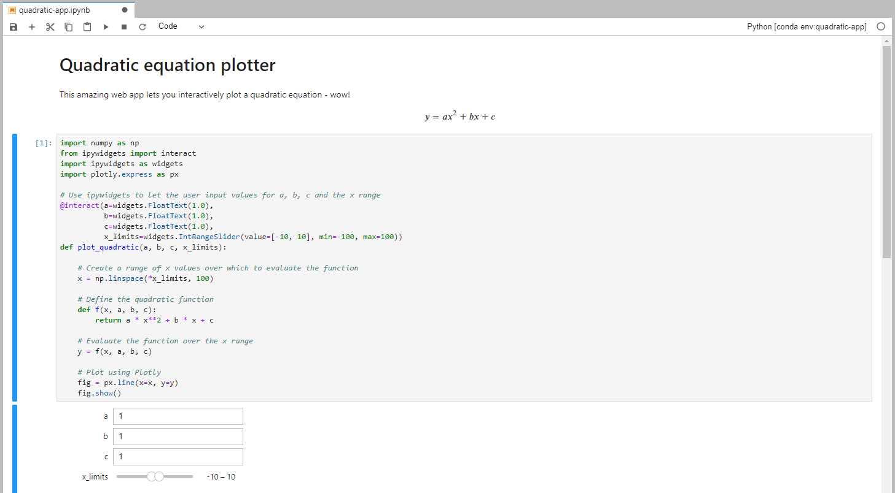
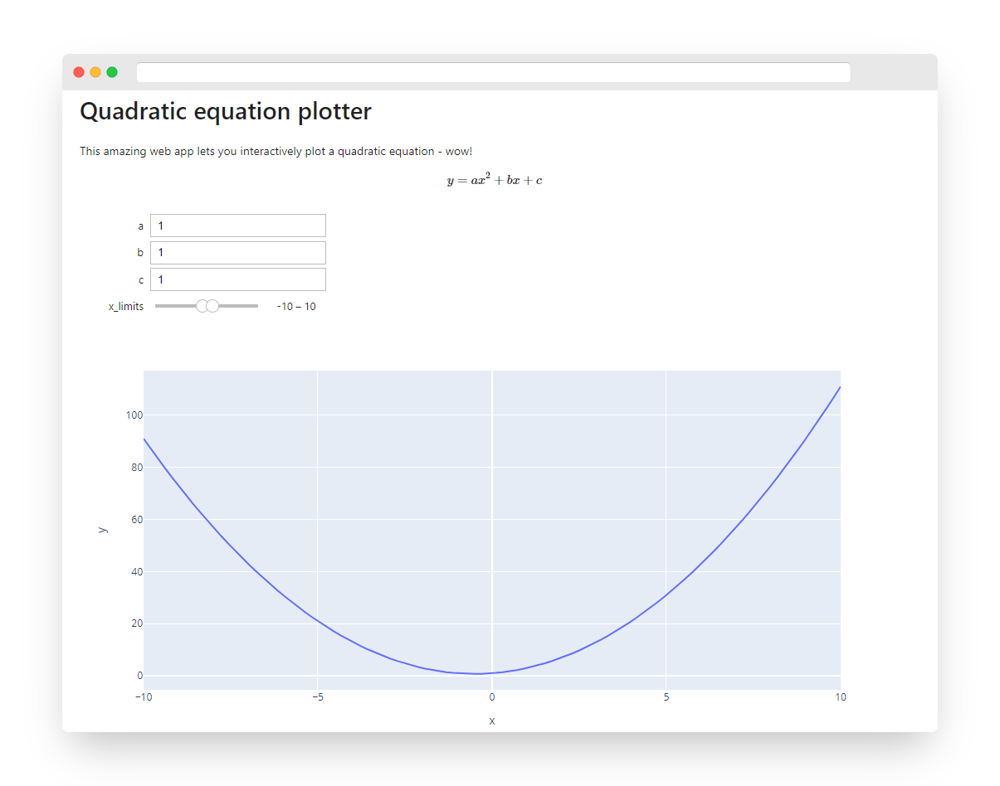

+++ 
draft = false
date = 2022-06-11T09:17:22+01:00
title = "Create and hosting an interactive app with Jupyter, Voilà and Heroku"
description = "Using Jupyter Notebooks, Voilà and Heroku to create and host an interactive web app"
tags = ["jupyter", "voila", "heroku"]
images = ["quadratic-app-ss2.png"]
+++

In this article, I will demonstrate how easy it is to create an interactive web app using Jupyter Notebooks, Voilà and Heroku. We will use Jupyter to create a simple notebook that plots a graph based on user input, turn this into an interactive dashboard using Voilà, and host it online using Heroku.

Before we get started, there are a few prerequisites:
- I am presuming that you already have Jupyter installed and are familiar with using it and Python in general.
- I am also presuming you're familiar with Git and package managers Conda and Pip. Having Git and Conda installed is needed to follow all of the steps.
- We are using ipywidgets to provide the interactivity, so familiarity with these would be useful.

## The app

The goal of our app is to let the user explore how changing the coefficients $a$, $b$ and $c$ to the quadratic equation alters the shape of the curve:

$$
y = ax^2 + bx + c
$$

A quintessential maths problem if ever there was one!

## Starting from scratch

We will be housing our notebook in a Git repository, which is the easiest way of pushing code to Heroku. So let's create a new folder to put our notebook in and initialise it as a Git repo:


mkdir quadratic-app
cd quadratic-app
git init


I like to keep things clean by creating a new virtual environment to install the packages required by my code. You will need this to tell Heroku what packages to install later. I am going to use Conda to create a new environment with the specific version of Python that I wish to use, and then use Pip to install all the packages I need within that environment. Why? I use Conda because it lets me test my app locally with exactly the same version of Python that is installed on Heroku (in contrast, Pip and virtual environments like `virtualenv` use the version of Python you already have installed and don't provide easy ways of installing arbitrary Python versions). But, Heroku requires a Pip `requirements.txt` file to install dependencies on the server, and this is why I use Pip to install everything except Python.


It might sound like overkill installing the specific Python version to match the Heroku server, but I have stumbled across issues not doing this enough times to warrant this small extra step! As you'll see later, debugging on Heroku is a little tricky, and so it is best to give our app the best chance of working from the start.


[This page](https://devcenter.heroku.com/articles/python-support) shows the latest versions of Python supported. At the time of writing, this is Python 3.10.4, and so we will use Conda to create a new environment with this locally:


conda create -n quadratic-app -c conda-forge python=3.10.4
conda activate quadratic-app


Here we have created an environment called `quadratic-app`, and then installed Python 3.10.4 in it from the conda-forge channel.

For this app, we are going to use NumPy, ipywidgets and Plotly Express (which also requires Pandas). Because we are building a Voilà app, we also need to install Voilà:


pip install numpy ipywidgets plotly pandas voila


As I already said, Heroku requires a `requirements.txt` file, so we can use Pip to create one based on what we have just installed:


pip freeze > requirements.txt


If you're not familiar with Pip, what this basically does is write a list of the packages and their versions to a file, such that they can be installed elsewhere (i.e. on the Heroku server).

## Creating the notebook

Okay, now we've got our environment set up, we can create the Jupyter Notebook itself.

We will use ipywidgets to let the user choose $a$, $b$, $c$ and x range values, then plot the function using Plotly. I chose [Plotly](https://plotly.com/python/), as opposed to the more ubiquitous matplotlib, as it is a bit more interactive and therefore suits the remit of an interactive web app a bit better.

This is our code:

```python
import numpy as np
from ipywidgets import interact
import ipywidgets as widgets
import plotly.express as px

# Use ipywidgets to let the user input values for a, b, c and the x range
@interact(a=widgets.FloatText(1.0),
          b=widgets.FloatText(1.0),
          c=widgets.FloatText(1.0),
          x_limits=widgets.IntRangeSlider(value=[-10, 10], min=-100, max=100))
def plot_quadratic(a, b, c, x_limits):

    # Create a range of x values over which to evaluate the function
    x = np.linspace(*x_limits, 100)

    # Define the quadratic function
    def f(x, a, b, c):
        return a * x**2 + b * x + c

    # Evaluate the function over the x range
    y = f(x, a, b, c)

    # Plot using Plotly
    fig = px.line(x=x, y=y)
    fig.show()
```

Let's create a Jupyter Notebook called `quadratic-app.ipynb` to run the code. Using Jupyter Lab, this might look something like this:



## Testing in Voilà 

Now we have created our app, we can make sure it runs locally using Voilà. For more detailed info on using Voilà, check out [their docs](https://voila.readthedocs.io/en/stable/), but for this simple demo, all we need to do is point Voilà towards our notebook:


voila quadratic-app.ipynb



This will launch a local server, probably using port 8866 (though it will tell you), and so all you need to do is open up `http://localhost:8866` in your web browser.



## From local to Heroku

Okay, so now we have created our notebook and used Voilà to render it as an interactive app. Now it is time to upload it to Heroku so that the world can access it.

Firstly, you need to [create a Heroku account](https://signup.heroku.com/) and install the Heroku CLI. There are very thorough details on installing the Heroku CLI on all platforms over at the [Heroku Dev Center](https://devcenter.heroku.com/articles/heroku-cli).

Once you have done this, you need to login to your account via the CLI. Running this command will open up a web browser for you to enter your credentials:


heroku login



If you are SSHed into another machine and don't have access to a web browser, then you can use the `-i` flag to login via the command line: `heroku login -i`. However, if you have multifactor authentication (MFA) enabled on your account (which Heroku strongly encourages), this option isn't available. If you absolutely need to login via the command line, you may wish to not opt for MFA.


Now we tell Heroku to create a new app from your repo:


Creating app... done, ⬢ quiet-meadow-91848
https://quiet-meadow-91848.herokuapp.com/ | https://git.heroku.com/quiet-meadow-91848.git


As you will see, Heroku has created our app and given it a unique web URL through which to access it. Before we do that though, we need to give Heroku some info about our app so it knows how to run it. This is done via two new files: `Procfile` and `runtime.txt`.

## Telling Heroku about our app

First, we need to tell Heroku which Python runtime to use. You'll remember that above, we installed Python 3.10.4. To tell Heroku to use this Python version, add `python-3.10.4` to the `runtime.txt` file, either via your favourite text editor or using this command:


echo "python-3.10.4" > runtime.txt


We also need to tell Heroku to run Voilà when we start the app, which is done by adding `web: voila --port=$PORT --Voila.ip=0.0.0.0 --no-browser quadratic-app.ipynb` to a file named `Procfile`. You can [read more about Procfiles here](https://devcenter.heroku.com/articles/procfile).


echo "web: voila --port=\$PORT --Voila.ip=0.0.0.0 --no-browser quadratic-app.ipynb" > Procfile


Let's dissect what's going on here:
- `web` is a "process type" that tells Heroku that we will be starting up a web server (Voilà) and expecting external traffic to it. Everything after `web: ` &nbsp;is run as a command on the server when our [dyno](https://www.heroku.com/dynos) starts up.
- `voila` is the command we saw before, which starts the Voilà server.
- `--port=$PORT` tells Voilà to bind your app to the environment variable `$PORT`. Heroku opens a specific port for you and sets `$PORT` to tell you what this is, hence you need to explicitly specify this.
- `--Voila.ip=0.0.0.0` is required from Voilà v0.3 and upwards as Voilà no longer listens on all interfaces by default ([see here](https://github.com/voila-dashboards/voila/issues/1047)). At the time of writing, this isn't yet reflected in [the docs](https://voila.readthedocs.io/en/stable/deploy.html), though I have a [pull request](https://github.com/voila-dashboards/voila/pull/1158) in to fix this.
- `-no-browser` simply tells Voilà not to try and open up a web browser on the server.
- `quadratic-app.ipynb` tells Voilà which notebook to load. If we want to load all notebooks, simply leave this filename out of the command.

Specifying the `--debug` parameter might also be useful if you need extra debugging information from Voilà.

Heroku will automatically detect the `requirements.txt` file that we created earlier and install the required dependencies.

## Testing it out

Before we push this code to the remote server, it's a good idea to test it locally. Make sure the Conda environment we created earlier is activated, and run:


heroku local


Heroku will tell you which local port to use to access your app, and this is usually 5000 (and so your app can be accessed at `http://localhost:5000`).

## We're good to go!

The final step is to commit your code and push to Heroku. This is as simple as:


git add .
git commit -m "Initial commit"
git push heroku master


Heroku will now print out lots of info as it sets up your server and installs all of your dependencies. If successful, it will tell you the URL that your app has been deployed to:

```
remote:        https://quiet-meadow-91848.herokuapp.com/ deployed to Heroku
remote:
remote: Verifying deploy... done.
To https://git.heroku.com/quiet-meadow-91848.git
 * [new branch]      master -> master
```

You can now head to that URL to check that your app is working as expected!

## Debugging

Unfortunately, it's rare that everything works as seamlessly as this simple example, and debugging Voilà-Heroku setups can be a bit tricky. Here are a few tips that might help:
- Use the `heroku logs --tail` command to show the server logs, which might give you some ideas.
- Specify the `--debug` flag in your Procfile command to get more detailed debugging info from Voilà.
- If your app works locally (`heroku local`) but not online, *make sure your environments are exactly the same*. Are you using the same version of Python? (Compare `python --version` to that specified in `runtime.txt`.) Are the same versions of all of the dependencies installed? If you have installed new packages since generating your `requirements.txt` file, then try re-creating this (`pip freeze > requirements.txt`).

## Final words

I hope you have found this post useful! I have placed a copy of the repo I created in this post on GitHub, so if you simply want to test the steps above without creating your own app, feel free to clone this and have a play around:

